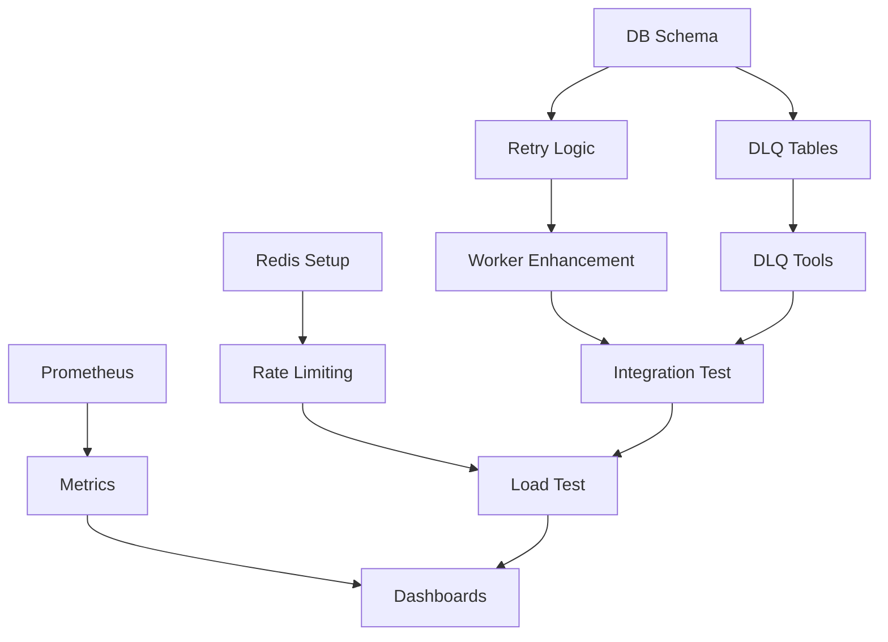

# システム信頼性向上 - 詳細実装要件書

## 1. プロジェクト概要

### 1.1 背景
本プロジェクトは、Prime Number Checking Microservicesの信頼性・可用性・運用性を向上させるため、以下4つの主要改善を実装する。

### 1.2 現在のアーキテクチャ
```
Client (React) → Web Server → MySQL → Outbox Publisher → NATS → Workers (Prime Check, Email Send) → External Services (Mailpit, Jaeger)
```

### 1.3 改善対象
1. **エラーハンドリング & リトライ機構**: メッセージロスト防止
2. **デッドレターキュー**: 処理失敗メッセージ管理
3. **レート制限**: DoS攻撃・過負荷防止
4. **モニタリング & メトリクス**: 運用可視化・アラート

### 1.4 期待効果
- **可用性**: 99.9% → 99.95%
- **MTTR**: 30分 → 5分
- **データロス**: 0.1% → 0.01%

---

## 2. 第1段階: エラーハンドリング & リトライ機構

### 2.1 技術仕様

#### 2.1.1 NATSストリーム設定
```go
// internal/shared/infrastructure/messaging.go
type StreamConfig struct {
    Name:           string
    Subjects:       []string
    Storage:        nats.FileStorage
    Replicas:       1
    MaxAge:         24 * time.Hour
    MaxMsgs:        1000000
    MaxBytes:       1024 * 1024 * 1024 // 1GB
    MaxMsgSize:     1024 * 1024        // 1MB
    // リトライ設定
    MaxDeliver:     3
    AckWait:        30 * time.Second
    BackOff: []time.Duration{
        1 * time.Second,   // 1回目の再試行
        2 * time.Second,   // 2回目の再試行  
        4 * time.Second,   // 3回目の再試行
    }
}
```

#### 2.1.2 データベーススキーマ拡張
```sql
-- 1. outboxテーブル拡張
ALTER TABLE outbox 
ADD COLUMN retry_count INT DEFAULT 0,
ADD COLUMN max_retries INT DEFAULT 3,
ADD COLUMN next_retry_at TIMESTAMP NULL,
ADD COLUMN error_message TEXT NULL,
ADD COLUMN last_error_at TIMESTAMP NULL,
ADD INDEX idx_next_retry_at (next_retry_at),
ADD INDEX idx_retry_count (retry_count);

-- 2. message_processing_logsテーブル作成
CREATE TABLE message_processing_logs (
    id BIGINT PRIMARY KEY AUTO_INCREMENT,
    message_id VARCHAR(255) NOT NULL,
    subject VARCHAR(255) NOT NULL,
    status ENUM('processing', 'success', 'failed', 'retry') NOT NULL,
    error_message TEXT,
    processing_time_ms INT,
    created_at TIMESTAMP DEFAULT CURRENT_TIMESTAMP,
    INDEX idx_message_id (message_id),
    INDEX idx_subject_status (subject, status),
    INDEX idx_created_at (created_at)
) ENGINE=InnoDB;

-- 3. worker_health_checksテーブル作成
CREATE TABLE worker_health_checks (
    id INT PRIMARY KEY AUTO_INCREMENT,
    worker_name VARCHAR(100) NOT NULL,
    status ENUM('healthy', 'unhealthy') NOT NULL,
    last_heartbeat TIMESTAMP NOT NULL,
    error_message TEXT,
    metadata JSON,
    created_at TIMESTAMP DEFAULT CURRENT_TIMESTAMP,
    updated_at TIMESTAMP DEFAULT CURRENT_TIMESTAMP ON UPDATE CURRENT_TIMESTAMP,
    UNIQUE KEY uk_worker_name (worker_name),
    INDEX idx_status_heartbeat (status, last_heartbeat)
) ENGINE=InnoDB;
```

### 2.2 実装ファイル

#### 2.2.1 新規作成ファイル
```
internal/shared/retry/
├── retry_policy.go          # リトライポリシー定義
├── backoff.go              # 指数バックオフ実装
└── circuit_breaker.go      # サーキットブレーカー

internal/shared/health/
├── checker.go              # ヘルスチェック機能
├── heartbeat.go            # ワーカーハートビート
└── status.go              # ステータス管理

internal/shared/logging/
├── structured.go           # 構造化ログ
├── error_tracking.go       # エラー追跡
└── correlation.go         # トレース相関
```

#### 2.2.2 修正対象ファイル
```
internal/shared/infrastructure/messaging.go
├── Subscribe関数拡張       # リトライロジック追加
├── processMessage拡張      # エラーハンドリング強化
└── ensureStream拡張       # ストリーム設定更新

cmd/prime-check-worker/main.go
├── エラーハンドリング追加    # 計算エラー対応
├── ヘルスチェック実装       # 生存監視
└── グレースフルシャットダウン # 適切な終了処理

cmd/email-send-worker/main.go
├── SMTP接続エラー処理      # メール送信失敗対応
├── 一時的失敗vs永続失敗    # エラー分類
└── バックプレッシャー対応   # 過負荷制御

internal/outbox/adapter/publisher.go
├── リトライロジック        # 失敗時再試行
├── バッチ処理最適化        # スループット向上
└── エラー状態管理         # 失敗メッセージ追跡
```

### 2.3 リトライポリシー詳細

#### 2.3.1 リトライ分類
```go
type ErrorType int

const (
    TransientError ErrorType = iota  // 一時的エラー（リトライ対象）
    PermanentError                   // 永続エラー（DLQ送り）
    PoisonMessage                    // 不正メッセージ（破棄）
)

type RetryPolicy struct {
    MaxRetries      int
    InitialInterval time.Duration
    MaxInterval     time.Duration
    Multiplier      float64
    ErrorClassifier func(error) ErrorType
}
```

#### 2.3.2 エラー分類ロジック
```go
func ClassifyError(err error) ErrorType {
    switch {
    case isNetworkError(err):       return TransientError
    case isDatabaseTimeout(err):    return TransientError
    case isInvalidInput(err):       return PermanentError
    case isResourceExhaustion(err): return TransientError
    default:                        return TransientError
    }
}
```

---

## 3. 第2段階: デッドレターキュー (DLQ)

### 3.1 DLQ設計

#### 3.1.1 DLQストリーム構成
```go
// DLQ専用ストリーム
type DLQConfig struct {
    StreamName:    "dead_letter_queue"
    Subject:       "dlq.*"
    Storage:       nats.FileStorage
    Retention:     7 * 24 * time.Hour  // 1週間保持
    MaxMsgs:       10000               // 最大10,000メッセージ
    DiscardPolicy: nats.DiscardOldest  // 古いものから削除
}

// サブジェクト分類
const (
    DLQPrimeCheck = "dlq.primecheck"      // Prime計算失敗
    DLQEmailSend  = "dlq.emailsend"       // Email送信失敗  
    DLQOutbox     = "dlq.outbox"          // Outbox処理失敗
)
```

#### 3.1.2 DLQ管理テーブル
```sql
CREATE TABLE dead_letter_messages (
    id BIGINT PRIMARY KEY AUTO_INCREMENT,
    original_subject VARCHAR(255) NOT NULL,
    original_message_id VARCHAR(255),
    payload JSON NOT NULL,
    error_message TEXT NOT NULL,
    error_type ENUM('transient', 'permanent', 'poison') NOT NULL,
    retry_count INT NOT NULL DEFAULT 0,
    original_created_at TIMESTAMP NOT NULL,
    dlq_created_at TIMESTAMP DEFAULT CURRENT_TIMESTAMP,
    last_retry_at TIMESTAMP NULL,
    status ENUM('pending', 'reprocessing', 'resolved', 'discarded') DEFAULT 'pending',
    resolved_at TIMESTAMP NULL,
    resolved_by VARCHAR(255) NULL,
    INDEX idx_subject (original_subject),
    INDEX idx_status_created (status, dlq_created_at),
    INDEX idx_error_type (error_type),
    INDEX idx_original_message_id (original_message_id)
) ENGINE=InnoDB;

-- DLQ統計テーブル  
CREATE TABLE dlq_statistics (
    id INT PRIMARY KEY AUTO_INCREMENT,
    date_hour TIMESTAMP NOT NULL,
    subject VARCHAR(255) NOT NULL,
    error_type ENUM('transient', 'permanent', 'poison') NOT NULL,
    count INT NOT NULL DEFAULT 1,
    created_at TIMESTAMP DEFAULT CURRENT_TIMESTAMP,
    UNIQUE KEY uk_date_subject_type (date_hour, subject, error_type),
    INDEX idx_date_hour (date_hour)
) ENGINE=InnoDB;
```

### 3.2 DLQ管理サイト

#### 3.2.1 Web UI機能
```
/dlq/dashboard
├── 失敗メッセージ一覧        # ページング、フィルタリング
├── エラータイプ別統計        # グラフ表示
├── 再処理バッチ実行         # 選択メッセージ一括処理
└── メッセージ詳細表示       # JSON整形、トレース情報

/dlq/api
├── GET /api/dlq/messages    # メッセージ一覧取得
├── POST /api/dlq/reprocess  # 再処理実行
├── DELETE /api/dlq/discard  # メッセージ破棄
└── GET /api/dlq/stats       # 統計情報取得
```

### 3.3 再処理ワークフロー

#### 3.3.1 自動再処理
```go
// 定期実行ジョブ
type DLQReprocessor struct {
    MaxBatchSize    int
    ReprocessRules  []ReprocessRule
}

type ReprocessRule struct {
    ErrorPattern    string        // エラーパターンマッチ
    WaitDuration    time.Duration // 待機時間
    MaxRetries      int          // 最大再試行回数
    Condition       func(msg *DLQMessage) bool
}

// 例: 一時的ネットワークエラーは30分後に自動再処理
rule := ReprocessRule{
    ErrorPattern: "network.*timeout",
    WaitDuration: 30 * time.Minute,
    MaxRetries:   2,
    Condition:    isNetworkError,
}
```

#### 3.3.2 手動再処理
```go
// 管理者による手動再処理
type ManualReprocessRequest struct {
    MessageIDs    []string      `json:"message_ids"`
    OverrideDelay time.Duration `json:"override_delay"`
    Force         bool          `json:"force"`
    Operator      string        `json:"operator"`
    Reason        string        `json:"reason"`
}
```

### 3.4 アラート設定

#### 3.4.1 アラート条件
```yaml
# Prometheus Alert Rules
groups:
  - name: dlq_alerts
    rules:
      - alert: DLQHighVolume
        expr: dlq_message_count > 100
        for: 5m
        labels:
          severity: warning
        annotations:
          summary: "DLQ message count is high"
          
      - alert: DLQErrorSpike  
        expr: increase(dlq_message_count[5m]) > 20
        for: 1m
        labels:
          severity: critical
        annotations:
          summary: "DLQ message spike detected"
```

#### 3.4.2 通知設定
- **Slack通知**: 重要度によって異なるチャンネル
- **Email通知**: 管理者グループ

---

## 4. 第3段階: レート制限

### 4.1 Redis設計

#### 4.1.1 Redis構成
```yaml
# docker-compose.yaml
redis:
  image: redis:7.2-alpine
  restart: unless-stopped
  ports:
    - "6379:6379"
  command: >
    redis-server 
    --appendonly yes
    --appendfsync everysec
    --maxmemory 128mb
    --maxmemory-policy allkeys-lru
  volumes:
    - redis_data:/data
  healthcheck:
    test: ["CMD", "redis-cli", "ping"]
    interval: 5s
    timeout: 3s
    retries: 5
```

#### 4.1.2 レート制限データ構造
```go
// Token Bucket実装
type RateLimiter struct {
    redisClient  *redis.Client
    keyPrefix    string
    bucketSize   int           // バケット容量
    refillRate   time.Duration // トークン補充間隔
    windowSize   time.Duration // 時間窓
}

// Redisキー設計
const (
    KeyFormat = "ratelimit:%s:%s"        // ratelimit:endpoint:identifier
    // 例: ratelimit:prime-check:192.168.1.100
    //     ratelimit:prime-check:user:12345
)

// Redis Lua Script (アトミック操作)
const rateLimitScript = `
local key = KEYS[1]
local window = tonumber(ARGV[1])
local limit = tonumber(ARGV[2])
local current_time = tonumber(ARGV[3])

local current = redis.call('INCR', key)
if current == 1 then
    redis.call('EXPIRE', key, window)
end

if current > limit then
    return 0  -- レート制限適用
else
    return 1  -- 許可
end
`
```

### 4.2 レート制限ポリシー

#### 4.2.1 エンドポイント別制限
```go
var RateLimitPolicies = map[string]RateLimit{
    "/prime-check": {
        PerIP:     {Requests: 60, Window: time.Minute},      // IP別
        PerUser:   {Requests: 100, Window: time.Minute},     // ユーザー別
        Global:    {Requests: 1000, Window: time.Minute},    // 全体
    },
    "/prime-check-list": {
        PerIP:     {Requests: 30, Window: time.Minute},
        PerUser:   {Requests: 50, Window: time.Minute},
    },
}

// 段階的制限
type TieredRateLimit struct {
    Burst      int                    // 瞬間最大値
    Sustained  int                    // 持続可能値
    Penalties  map[string]time.Duration // ペナルティ時間
}
```

#### 4.2.2 バイパス・例外設定
```go
type RateLimitConfig struct {
    Whitelist    []string  // IP白名单
    AdminTokens  []string  // 管理者トークン
    ServiceKeys  []string  // サービス間認証キー
    
    // 動的調整
    AutoScaling  bool      // 負荷に応じた自動調整
    BurstMultiplier float64 // バースト時の倍率
}
```

### 4.3 ミドルウェア実装

#### 4.3.1 HTTPミドルウェア
```go
// internal/middleware/rate_limiter.go
func NewRateLimiter(redis *redis.Client, config Config) *RateLimiter {
    return &RateLimiter{
        redis:    redis,
        config:   config,
        policies: loadPolicies(),
    }
}

func (r *RateLimiter) Middleware(next http.Handler) http.Handler {
    return http.HandlerFunc(func(w http.ResponseWriter, req *http.Request) {
        // 1. 識別子抽出 (IP, User, API Key)
        identifier := extractIdentifier(req)
        
        // 2. ポリシー適用
        allowed, remaining, resetTime := r.checkRateLimit(req.URL.Path, identifier)
        
        // 3. ヘッダー設定
        setRateLimitHeaders(w, remaining, resetTime)
        
        // 4. 制限判定
        if !allowed {
            http.Error(w, "Rate limit exceeded", http.StatusTooManyRequests)
            return
        }
        
        next.ServeHTTP(w, req)
    })
}
```

#### 4.3.2 レスポンスヘッダー
```
X-RateLimit-Limit: 100
X-RateLimit-Remaining: 95  
X-RateLimit-Reset: 1640995200
X-RateLimit-Policy: per-user
Retry-After: 60
```

### 4.4 監視・アラート

#### 4.4.1 メトリクス収集
```go
// Prometheus metrics
var (
    rateLimitHits = prometheus.NewCounterVec(
        prometheus.CounterOpts{
            Name: "rate_limit_hits_total",
            Help: "Rate limit hits by endpoint and result",
        },
        []string{"endpoint", "result", "policy"},
    )
    
    rateLimitLatency = prometheus.NewHistogramVec(
        prometheus.HistogramOpts{
            Name: "rate_limit_check_duration_seconds",
            Help: "Rate limit check duration",
        },
        []string{"endpoint"},
    )
)
```

#### 4.4.2 ダッシュボード
```
Rate Limiting Dashboard
├── リクエスト/秒グラフ       # リアルタイム表示
├── 制限発動回数             # エンドポイント別
├── トップIP/ユーザー        # 上位消費者
└── Redis接続状態           # 可用性監視
```

---

## 5. 第4段階: モニタリング & メトリクス

### 5.1 Prometheus + Grafana構成

#### 5.1.1 Docker構成
```yaml
# docker-compose.monitoring.yaml
prometheus:
  image: prom/prometheus:v2.48.0
  container_name: prometheus
  ports:
    - "9090:9090"
  volumes:
    - ./monitoring/prometheus.yml:/etc/prometheus/prometheus.yml
    - ./monitoring/alerts:/etc/prometheus/alerts
    - prometheus_data:/prometheus
  command:
    - '--config.file=/etc/prometheus/prometheus.yml'
    - '--storage.tsdb.path=/prometheus'
    - '--web.console.libraries=/etc/prometheus/console_libraries'
    - '--web.console.templates=/etc/prometheus/consoles'
    - '--storage.tsdb.retention.time=7d'
    - '--web.enable-lifecycle'
    - '--web.enable-admin-api'

grafana:
  image: grafana/grafana:10.2.2
  container_name: grafana
  ports:
    - "3000:3000"
  environment:
    - GF_SECURITY_ADMIN_PASSWORD=admin123
    - GF_USERS_ALLOW_SIGN_UP=false
  volumes:
    - ./monitoring/grafana/datasources:/etc/grafana/provisioning/datasources
    - ./monitoring/grafana/dashboards:/etc/grafana/provisioning/dashboards
    - grafana_data:/var/lib/grafana

alertmanager:
  image: prom/alertmanager:v0.26.0
  container_name: alertmanager  
  ports:
    - "9093:9093"
  volumes:
    - ./monitoring/alertmanager.yml:/etc/alertmanager/alertmanager.yml
```

#### 5.1.2 Prometheus設定
```yaml
# monitoring/prometheus.yml
global:
  scrape_interval: 15s
  evaluation_interval: 15s

rule_files:
  - "alerts/*.yml"

scrape_configs:
  - job_name: 'web-server'
    static_configs:
      - targets: ['web-server:8080']
    metrics_path: /metrics
    scrape_interval: 5s
    
  - job_name: 'prime-check-worker'
    static_configs:
      - targets: ['prime-check-worker:8081']
    
  - job_name: 'email-send-worker'  
    static_configs:
      - targets: ['email-send-worker:8082']
      
  - job_name: 'redis'
    static_configs:
      - targets: ['redis:6379']
      
  - job_name: 'mysql'
    static_configs:
      - targets: ['mysql:3306']

alerting:
  alertmanagers:
    - static_configs:
        - targets: ['alertmanager:9093']
```

### 5.2 メトリクス定義

#### 5.2.1 ビジネスメトリクス
```go
// internal/metrics/business.go
var (
    // Prime Check関連
    primeCheckRequests = prometheus.NewCounterVec(
        prometheus.CounterOpts{
            Name: "prime_check_requests_total",
            Help: "Total prime check requests",
        },
        []string{"status", "result"},
    )
    
    primeCheckDuration = prometheus.NewHistogramVec(
        prometheus.HistogramOpts{
            Name: "prime_check_duration_seconds", 
            Help: "Prime check processing duration",
            Buckets: []float64{0.1, 0.5, 1.0, 2.0, 5.0, 10.0, 30.0},
        },
        []string{"number_length"},
    )
    
    // Email関連
    emailsSent = prometheus.NewCounterVec(
        prometheus.CounterOpts{
            Name: "emails_sent_total",
            Help: "Total emails sent",
        },
        []string{"status"},
    )
    
    // Queue関連  
    messageQueueLength = prometheus.NewGaugeVec(
        prometheus.GaugeOpts{
            Name: "message_queue_length",
            Help: "Current message queue length", 
        },
        []string{"queue_name"},
    )
)
```

#### 5.2.2 システムメトリクス
```go
var (
    // データベース
    dbConnections = prometheus.NewGaugeVec(
        prometheus.GaugeOpts{
            Name: "database_connections",
            Help: "Current database connections",
        },
        []string{"state"}, // active, idle, wait
    )
    
    dbQueryDuration = prometheus.NewHistogramVec(
        prometheus.HistogramOpts{
            Name: "database_query_duration_seconds",
            Help: "Database query duration",
            Buckets: prometheus.DefBuckets,
        },
        []string{"query_type"},
    )
    
    // Redis
    redisConnections = prometheus.NewGauge(
        prometheus.GaugeOpts{
            Name: "redis_connected_clients",
            Help: "Redis connected clients",
        },
    )
    
    // NATS
    natsConsumerPending = prometheus.NewGaugeVec(
        prometheus.GaugeOpts{
            Name: "nats_consumer_pending_messages",
            Help: "NATS consumer pending messages",
        },
        []string{"stream", "consumer"},
    )
)
```

### 5.4 アラート設定

#### 5.4.1 アラートルール
```yaml
# monitoring/alerts/application.yml
groups:
  - name: application_alerts
    rules:
      # 可用性アラート
      - alert: HighErrorRate
        expr: |
          (
            rate(http_requests_total{status=~"5.."}[5m]) / 
            rate(http_requests_total[5m])
          ) * 100 > 5
        for: 2m
        labels:
          severity: critical
        annotations:
          summary: "High error rate detected"
          description: "Error rate is {{ $value }}% for the last 5 minutes"
          
      # レイテンシアラート  
      - alert: HighLatency
        expr: |
          histogram_quantile(0.95, 
            rate(http_request_duration_seconds_bucket[5m])
          ) > 2
        for: 5m
        labels:
          severity: warning
        annotations:
          summary: "High latency detected"
          
      # DLQアラート
      - alert: DLQBacklog
        expr: dlq_message_count > 50
        for: 1m
        labels:
          severity: warning
        annotations:
          summary: "DLQ backlog is growing"
          
      # ワーカーダウン
      - alert: WorkerDown
        expr: up{job=~".*worker"} == 0
        for: 1m
        labels:
          severity: critical
        annotations:
          summary: "Worker {{ $labels.job }} is down"
```

#### 5.4.2 アラート通知
```yaml
# monitoring/alertmanager.yml
global:
  smtp_smarthost: 'localhost:1025'
  smtp_from: 'alerts@primecheck.local'

route:
  group_by: ['alertname']
  group_wait: 10s
  group_interval: 10s
  repeat_interval: 1h
  receiver: 'web.hook'
  routes:
    - match:
        severity: critical
      receiver: 'critical-alerts'
    - match:
        severity: warning  
      receiver: 'warning-alerts'

receivers:
  - name: 'critical-alerts'
    slack_configs:
      - api_url: 'YOUR_SLACK_WEBHOOK_URL'
        channel: '#alerts-critical'
        title: 'Critical Alert'
        text: '{{ range .Alerts }}{{ .Annotations.summary }}{{ end }}'
        
  - name: 'warning-alerts'
    email_configs:
      - to: 'devops@company.com'
        subject: 'Warning Alert'
        body: '{{ .CommonAnnotations.summary }}'
```

### 5.5 Grafanaダッシュボード

#### 5.5.1 メインダッシュボード
```json
{
  "dashboard": {
    "title": "Prime Check System Overview",
    "panels": [
      {
        "title": "Request Rate",
        "type": "graph",
        "targets": [
          {
            "expr": "rate(http_requests_total[5m])",
            "legendFormat": "{{method}} {{status}}"
          }
        ]
      },
      {
        "title": "Error Rate", 
        "type": "stat",
        "targets": [
          {
            "expr": "(rate(http_requests_total{status=~\"5..\"}[5m]) / rate(http_requests_total[5m])) * 100",
            "legendFormat": "Error Rate %"
          }
        ]
      },
      {
        "title": "Response Time",
        "type": "graph", 
        "targets": [
          {
            "expr": "histogram_quantile(0.95, rate(http_request_duration_seconds_bucket[5m]))",
            "legendFormat": "95th percentile"
          },
          {
            "expr": "histogram_quantile(0.99, rate(http_request_duration_seconds_bucket[5m]))", 
            "legendFormat": "99th percentile"
          }
        ]
      }
    ]
  }
}
```

#### 5.5.2 専用ダッシュボード
```
ダッシュボード一覧:
├── System Overview          # システム全体概要
├── Prime Check Details      # Prime計算詳細
├── Message Queue Monitor    # キュー監視
├── Database Performance     # DB性能
├── Redis Monitoring         # Redis監視  
├── Error Analysis          # エラー分析
└── SLO Dashboard           # SLO追跡
```

---

## 6. 実装スケジュール

### 6.1 週別実装計画

#### Week 1: エラーハンドリング基盤
- [ ] **Day 1-2**: データベーススキーマ拡張
- [ ] **Day 3-4**: リトライポリシー実装
- [ ] **Day 5**: NATS設定更新・テスト

#### Week 2: ワーカー強化
- [ ] **Day 1-2**: prime-check-worker拡張
- [ ] **Day 3-4**: email-send-worker拡張  
- [ ] **Day 5**: 統合テスト・バグ修正

#### Week 3: DLQ実装
- [ ] **Day 1-2**: DLQストリーム・テーブル作成
- [ ] **Day 3-4**: DLQ管理ツール開発
- [ ] **Day 5**: DLQ再処理ロジック

#### Week 4: レート制限
- [ ] **Day 1-2**: Redis導入・設定
- [ ] **Day 3-4**: レート制限ミドルウェア
- [ ] **Day 5**: ポリシー調整・テスト

#### Week 5: モニタリング基盤
- [ ] **Day 1-2**: Prometheus・Grafana導入
- [ ] **Day 3-4**: メトリクス実装
- [ ] **Day 5**: ダッシュボード作成

#### Week 6: 完成・最適化
- [ ] **Day 1-2**: アラート設定

### 6.2 依存関係・クリティカルパス



### 6.3 リスク管理

#### 6.3.1 技術リスク
| リスク | 影響 | 発生確率 | 軽減策 |
|--------|------|----------|--------|
| NATS設定ミス | 高 | 中 | 段階的ロールアウト、バックアップ計画 |
| Redis性能問題 | 中 | 低 | 負荷テスト、クラスター化準備 |
| DB移行失敗 | 高 | 低 | 十分なバックアップ、ロールバック手順 |

#### 6.3.2 スケジュールリスク
| リスク | 影響 | 発生確率 | 軽減策 |
|--------|------|----------|--------|
| 要件変更 | 中 | 中 | バッファ期間確保、段階的リリース |
| テスト期間不足 | 高 | 中 | 自動テスト強化、並行テスト実施 |
| 統合問題 | 中 | 中 | 早期統合テスト、継続的結合 |

---

## 7. 運用・保守

### 7.1 日常監視項目

#### 7.1.1 チェックリスト
```bash
# 毎日実行する監視スクリプト
#!/bin/bash

# 1. システム稼働状況
curl -f http://localhost:8080/health || echo "Web server down"
docker ps | grep -E "(prime-check|email-send)" || echo "Workers down"

# 2. キュー蓄積チェック  
redis-cli llen message_queue || echo "Redis connection failed"
mysql -e "SELECT COUNT(*) FROM outbox WHERE processed = 0" || echo "DB connection failed"

# 3. エラー率チェック
curl -s http://localhost:9090/api/v1/query?query='rate(http_requests_total{status=~"5.."}[5m])' | jq '.data.result[0].value[1]'

# 4. ディスク容量
df -h | awk '$5 > 80 {print "Disk usage warning: " $0}'
```

#### 7.1.2 自動アラート
- エラー率 > 1%: Slack通知
- レスポンス時間 > 5s: Email通知  
- キュー蓄積 > 1000件: PagerDuty通知
- ワーカーダウン: 即座に管理者コール

### 7.2 トラブルシューティング

#### 7.2.1 一般的な問題と対処法
```bash
# Solution 2: キューリセット
redis-cli del message_queue:primecheck

# Problem: DLQ に大量蓄積
# Solution: バッチ再処理
go run cmd/dlq-admin/main.go reprocess --batch=100 --delay=1s

# Problem: レート制限誤作動  
# Solution: 制限リセット
redis-cli del ratelimit:prime-check:*
```

---

## 9. 検収基準

### 9.1 機能検収

#### 9.1.1 第1段階: エラーハンドリング
- [ ] メッセージ処理失敗時の自動リトライが動作する
- [ ] 指数バックオフが正しく実装されている  
- [ ] 最大リトライ回数に達した後DLQに送られる
- [ ] ワーカーのヘルスチェックが動作する
- [ ] データベースエラー時の適切な処理

#### 9.1.2 第2段階: DLQ
- [ ] DLQメッセージが正しく蓄積される
- [ ] Web UIでDLQメッセージが表示される
- [ ] 手動再処理が動作する
- [ ] 自動再処理ルールが動作する
- [ ] DLQアラートが正しく発火する

#### 9.1.3 第3段階: レート制限  
- [ ] IP別レート制限が動作する
- [ ] ユーザー別レート制限が動作する
- [ ] 適切なHTTPステータス・ヘッダーが返される
- [ ] Redis障害時の適切なフォールバック
- [ ] 管理者用バイパスが動作する

#### 9.1.4 第4段階: モニタリング
- [ ] Prometheusメトリクスが収集される
- [ ] Grafanaダッシュボードが表示される
- [ ] アラートが正しく発火・通知される

### 9.3 運用検収

#### 9.3.1 監視・アラート
- [ ] 各メトリクスが正しくGrafanaに表示される
- [ ] 閾値を超えた際にアラートが発火する
- [ ] Slack/Email通知が届く
- [ ] PagerDuty通知が届く (Critical のみ)

#### 9.3.2 障害復旧
- [ ] ワーカー停止→自動再起動が動作する
- [ ] データベース接続断→復旧時自動再接続
- [ ] NATS切断→自動再接続が動作する
- [ ] Redis障害→適切なフォールバック

#### 9.3.3 運用ツール
- [ ] DLQ管理CLIが動作する
- [ ] ログ分析ツールが動作する  
- [ ] メトリクスクエリが動作する
- [ ] ダッシュボードカスタマイズが可能

---

## 10. 完了後の継続改善

### 10.1 Phase 2 候補機能

#### 10.1.1 高度な監視
- **OpenTelemetry**: 分散トレーシング強化
- **Elastic Stack**: ログ集約・検索
- **Custom Metrics**: ビジネス固有指標

```

---

## 付録

### A. 設定ファイルテンプレート

#### A.1 Environment Variables
```bash
# .env.production
MYSQL_HOST=mysql
MYSQL_PORT=3306
MYSQL_DATABASE=prime_check_db
MYSQL_USER=prime_check_user
MYSQL_PASSWORD=${MYSQL_PASSWORD}

REDIS_HOST=redis
REDIS_PORT=6379
REDIS_PASSWORD=${REDIS_PASSWORD}

NATS_HOST=nats
NATS_PORT=4222

JAEGER_HOST=jaeger
JAEGER_PORT=4317

# Rate Limiting
RATE_LIMIT_REDIS_HOST=redis:6379
RATE_LIMIT_DEFAULT_LIMIT=100
RATE_LIMIT_WINDOW_SECONDS=60

# Monitoring
PROMETHEUS_URL=http://prometheus:9090
GRAFANA_URL=http://grafana:3000
ALERTMANAGER_URL=http://alertmanager:9093

# Security
JWT_SECRET=${JWT_SECRET}
ENCRYPTION_KEY=${ENCRYPTION_KEY}
ADMIN_API_KEYS=${ADMIN_API_KEYS}
```

#### A.2 Dockerfile Template
```dockerfile
# Dockerfile.worker
FROM golang:1.21-alpine AS builder
WORKDIR /app
COPY go.mod go.sum ./
RUN go mod download
COPY . .
RUN go build -ldflags="-w -s" -o worker cmd/prime-check-worker/main.go

FROM alpine:3.19
RUN apk --no-cache add ca-certificates tzdata
WORKDIR /root/
COPY --from=builder /app/worker .
EXPOSE 8081
HEALTHCHECK --interval=30s --timeout=5s --retries=3 \
  CMD wget --quiet --tries=1 --spider http://localhost:8081/health || exit 1
CMD ["./worker"]
```

### B. 運用スクリプト

#### B.1 デプロイスクリプト
```bash
#!/bin/bash
# deploy.sh

set -e

VERSION=${1:-latest}
ENVIRONMENT=${2:-staging}

echo "Deploying version $VERSION to $ENVIRONMENT"

# 1. バックアップ
docker-compose exec mysql mysqldump prime_check_db > backup_$(date +%Y%m%d_%H%M%S).sql

# 2. イメージビルド
docker-compose build --build-arg VERSION=$VERSION

# 3. Blue-Green デプロイ
docker-compose up -d --scale prime-check-worker=2 prime-check-worker-new
sleep 30

# 4. ヘルスチェック
curl -f http://localhost:8080/health || exit 1

# 5. 旧バージョン停止
docker-compose stop prime-check-worker-old
docker-compose rm -f prime-check-worker-old

# 6. 最終確認
docker-compose ps
echo "Deploy completed successfully"
```

#### B.2 監視スクリプト
```bash
#!/bin/bash
# monitor.sh

# システムヘルスチェック
check_health() {
    echo "=== System Health Check ==="
    
    # API Health
    curl -s http://localhost:8080/health | jq '.status' || echo "API Down"
    
    # Database
    mysql -h localhost -u root -p${MYSQL_ROOT_PASSWORD} -e "SELECT 1" || echo "DB Down"
    
    # Redis
    redis-cli ping || echo "Redis Down"
    
    # NATS
    curl -s http://localhost:8222/varz | jq '.connections' || echo "NATS Down"
    
    # Workers
    docker ps --format "table {{.Names}}\t{{.Status}}" | grep worker
}

# メトリクス取得
get_metrics() {
    echo "=== Key Metrics ==="
    
    # Request Rate
    echo -n "Request Rate: "
    curl -s 'http://localhost:9090/api/v1/query?query=rate(http_requests_total[1m])' | jq '.data.result[0].value[1]'
    
    # Error Rate  
    echo -n "Error Rate: "
    curl -s 'http://localhost:9090/api/v1/query?query=rate(http_requests_total{status=~"5.."}[5m])/rate(http_requests_total[5m])' | jq '.data.result[0].value[1]'
    
    # Queue Length
    echo -n "Queue Length: "
    redis-cli llen message_queue
}

# ログ分析
analyze_logs() {
    echo "=== Recent Errors ==="
    docker-compose logs --tail=50 | grep -i error | tail -10
    
    echo "=== Performance Issues ==="
    docker-compose logs --tail=100 | grep "duration" | sort -k3 -nr | head -5
}

# メイン実行
check_health
echo ""
get_metrics  
echo ""
analyze_logs
```

この詳細実装要件書により、チーム全体で共通認識を持ち、段階的かつ確実にシステムの信頼性向上を実現できます。