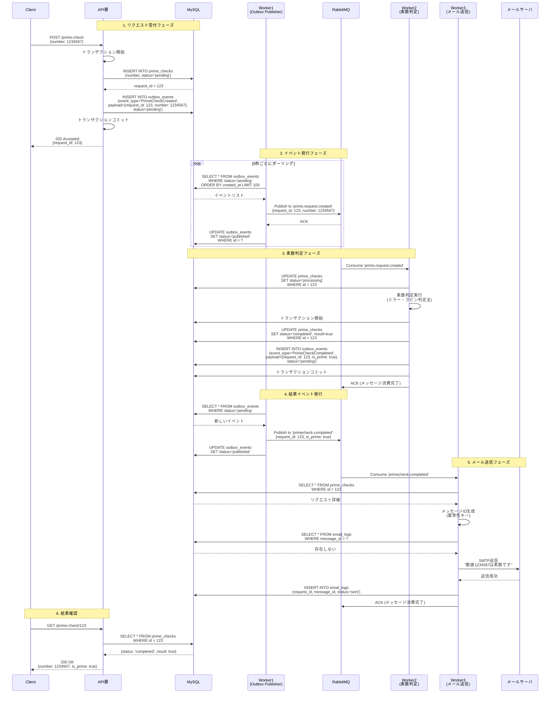

```mermaid
sequenceDiagram
    participant Client
    participant API as API層
    participant DB as MySQL
    participant Worker1 as Worker1<br/>(Outbox Publisher)
    participant MQ as RabbitMQ
    participant Worker2 as Worker2<br/>(素数判定)
    participant Worker3 as Worker3<br/>(メール送信)
    participant Mail as メールサーバ

    Note over API,DB: 1. リクエスト受付フェーズ
    Client->>API: POST /prime-check<br/>{number: 1234567}
    API->>API: トランザクション開始
    API->>DB: INSERT INTO prime_checks<br/>(number, status='pending')
    DB-->>API: request_id = 123
    API->>DB: INSERT INTO outbox_events<br/>(event_type='PrimeCheckCreated',<br/>payload={request_id: 123, number: 1234567},<br/>status='pending')
    API->>API: トランザクションコミット
    API-->>Client: 202 Accepted<br/>{request_id: 123}

    Note over Worker1,MQ: 2. イベント発行フェーズ
    loop 5秒ごとにポーリング
        Worker1->>DB: SELECT * FROM outbox_events<br/>WHERE status='pending'<br/>ORDER BY created_at LIMIT 100
        DB-->>Worker1: イベントリスト
        Worker1->>MQ: Publish to 'prime.request.created'<br/>{request_id: 123, number: 1234567}
        MQ-->>Worker1: ACK
        Worker1->>DB: UPDATE outbox_events<br/>SET status='published'<br/>WHERE id = ?
    end

    Note over Worker2,DB: 3. 素数判定フェーズ
    MQ->>Worker2: Consume 'prime.request.created'
    Worker2->>DB: UPDATE prime_checks<br/>SET status='processing'<br/>WHERE id = 123
    Worker2->>Worker2: 素数判定実行<br/>(ミラー・ラビン判定法)
    Worker2->>DB: トランザクション開始
    Worker2->>DB: UPDATE prime_checks<br/>SET status='completed', result=true<br/>WHERE id = 123
    Worker2->>DB: INSERT INTO outbox_events<br/>(event_type='PrimeCheckCompleted',<br/>payload={request_id: 123, is_prime: true},<br/>status='pending')
    Worker2->>DB: トランザクションコミット
    Worker2->>MQ: ACK (メッセージ消費完了)

    Note over Worker1,MQ: 4. 結果イベント発行
    Worker1->>DB: SELECT * FROM outbox_events<br/>WHERE status='pending'
    DB-->>Worker1: 新しいイベント
    Worker1->>MQ: Publish to 'primecheck.completed'<br/>{request_id: 123, is_prime: true}
    Worker1->>DB: UPDATE outbox_events<br/>SET status='published'

    Note over Worker3,Mail: 5. メール送信フェーズ
    MQ->>Worker3: Consume 'primecheck.completed'
    Worker3->>DB: SELECT * FROM prime_checks<br/>WHERE id = 123
    DB-->>Worker3: リクエスト詳細
    Worker3->>Worker3: メッセージID生成<br/>(冪等性キー)
    Worker3->>DB: SELECT * FROM email_logs<br/>WHERE message_id = ?
    DB-->>Worker3: 存在しない
    Worker3->>Mail: SMTP送信<br/>"数値1234567は素数です"
    Mail-->>Worker3: 送信成功
    Worker3->>DB: INSERT INTO email_logs<br/>(request_id, message_id, status='sent')
    Worker3->>MQ: ACK (メッセージ消費完了)

    Note over Client,API: 6. 結果確認
    Client->>API: GET /prime-check/123
    API->>DB: SELECT * FROM prime_checks<br/>WHERE id = 123
    DB-->>API: {status: 'completed', result: true}
    API-->>Client: 200 OK<br/>{number: 1234567, is_prime: true}
```